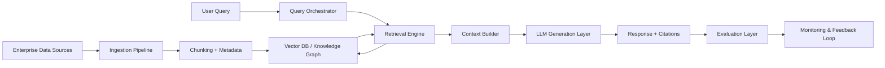

# Enterprise RAG Architectures

Designing retrieval-augmented generation systems for reliability, governance, and production-grade intelligence at scale.

---

## Core Layers

A production-grade Retrieval-Augmented Generation (RAG) architecture is not just “LLM + vector DB.” It is a multi-layered system combining retrieval precision, orchestration intelligence, and enterprise-grade controls.

### 1. Data Ingestion Layer
- Structured (databases, warehouses)
- Semi-structured (Excel, PDFs)
- Unstructured (emails, transcripts)

### 2. Retrieval Layer
- Vector databases
- Hybrid retrieval (BM25 + embeddings)
- Knowledge graphs
- Policy-aware filtering

### 3. Orchestration Layer
- Query rewriting
- Multi-step retrieval
- Context assembly

### 4. Generation Layer
- LLMs
- Prompt templates
- Structured outputs

### 5. Evaluation Layer
- Retrieval metrics
- Groundedness scoring
- Monitoring

---

## Architecture Diagram

---

## Design Principles

- Treat retrieval as a first-class product
- Separate retrieval and generation
- Enforce governance and security
- Optimize for groundedness
- Build feedback loops

---

## Finance Use Case

### Problem
- Complex regulations
- Fragmented data
- High audit requirements

### Solution
- Hybrid retrieval
- Knowledge graph linking
- Explainable outputs

### Example Query
Explain variance in liquidity coverage ratio.

---

## Healthcare Use Case

### Problem
- Disparate records
- Evolving medical knowledge
- High risk of errors

### Solution
- Context-aware retrieval
- Temporal reasoning
- Clinical validation

### Example Query
Treatment adjustments for diabetic patient with renal decline.

---

## Future Evolution

- Graph RAG
- Real-time RAG
- Agentic systems
- Multimodal RAG

---

## Next Steps

1. Build retrieval-first architecture  
2. Implement evaluation metrics  
3. Add governance  
4. Start with key use cases  
5. Iterate continuously  

---

## Final Thought

Enterprise RAG is a foundational data intelligence layer that transforms how organizations interact with knowledge.
